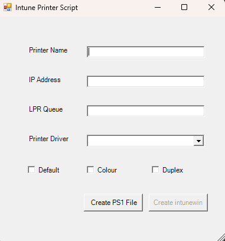

This script automates the creation of .intunewin files for installing printers through Microsoft Intune. Simply provide the printer's name, IP address, color, double-sided printing settings, and driver name. If you use LPR printing, you can also specify the LPR queue.

## How to use:
1. **Run the script:**
    * Right-click on 'Script-Printer-GUI.ps1' and select "Run with Powershell" or run run.bat
    * If prompted, click download "IntuneWinappUtil.exe"

2. **Enter Printer Details:**
    * Provide the printer's name, IP address, color, double-sided printing setting and driver name.
    * If using LPR, specify the LPR queue.

3. **Create printer files:**
    * Click on button "Create PS1 File" and then click on "Create intunewin" button and the following files will be created:
        * `install-PrinterName.ps1` (Installation script)
        * `uninstall-PrinterName.ps1` (Uninstallation script)
        * `settings-PrinterName.txt` (Intune settings)
        * `install-PrinterName.intunewin` (Intune Win32 app)

### Notes        

* Edit the json file to fit your printer driver names.    
* Some printer manufacturers may not support configuring color, black and white, or double-sided printing through PowerShell.
* Ensure the printer drivers are added to Intune or installed on local PCs before using this script.

